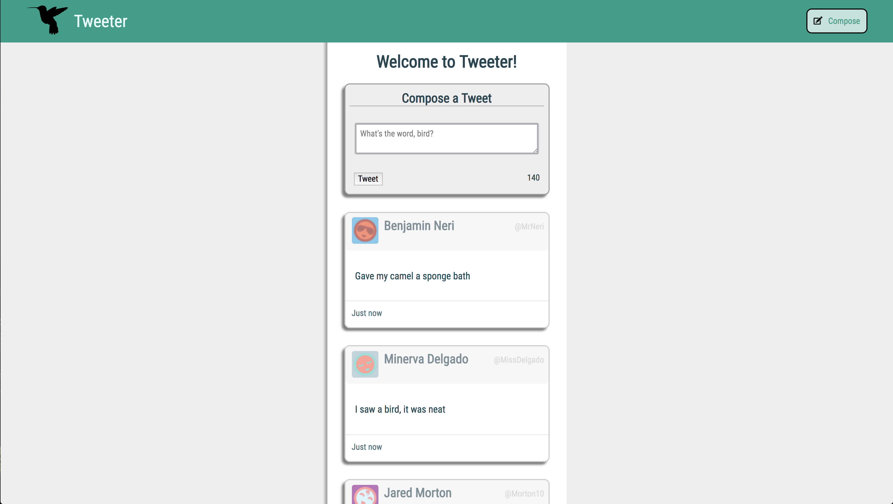

# Tweeter Project

Tweeter is a simple, single-page Twitter clone.

This version of Tweeter was created by Benji Leboe for week 3 at Lighthouse Labs. 

## Getting Started

1. Fork this repository, then clone your fork of this repository.
2. Install dependencies using the `npm install` command.
3. Start the web server using the `npm run local` command. The app will be served at <http://localhost:8080/>.
4. Go to <http://localhost:8080/> in your browser.

## Dependencies

- Express
- Node 5.10.x or above
- body-parser
- chance
- md5
- mongodb

## Overview

Tweeter allows users to submit posts of up to 140 characters and display them on the main page. The post gets saved in an external Mongo database for data persistence.

## Features

- 140 character limit with responsive character counter
- Show/hide tweet composer; autofocus on show
- Submit tweets with enter key
- Real-time tweet age display
- Highlight posts on mouseover